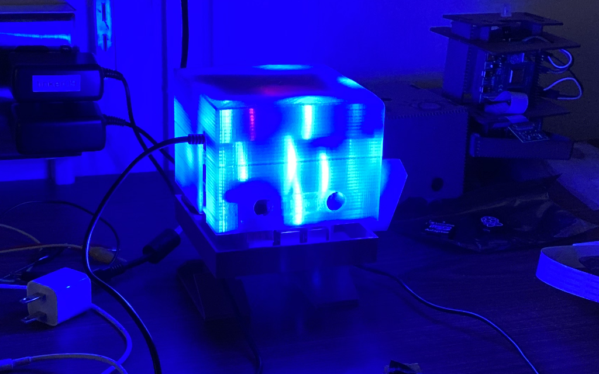
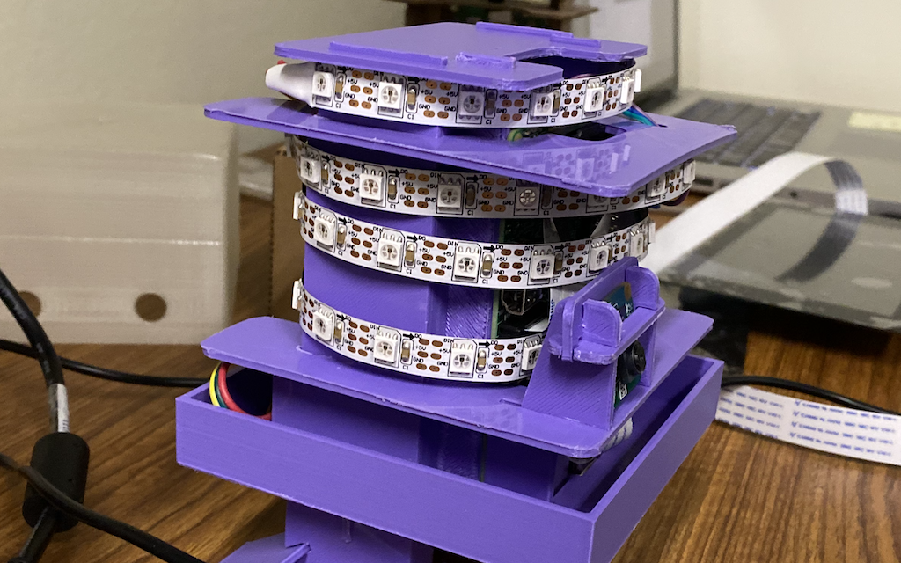

# tjlamp-client
It's like TJBot, but it's also a lamp!

## Wiring

Wrap a NeoPixel strip (60 LEDs) around the inside of TJBot. Cover with a translucent 3d-printed head.

### NeoPixels

| Function | Color | PIN |
|---|---|---|
| Power  | Red     | 1 (+3.3V, top left) |
| Ground | Yellow  | 6 (GND, 3 pins down on the right)   |
| Data   | Middle of 3-pin connector | 12 (PWM0, 6 pins down on the right) |

### Servo

| Function | Color | PIN |
|---|---|---|
| Power  | Red     | 2 (+5V, top right) |
| Ground | Brown   | 20 (GND, 10 pins down on the right)   |
| Data   | Orange  | 26 (GPIO7, 13 pins down on the right) |

## Setup

0. Check out `tjlamp-client` to your Desktop. If you check it out to another path, be sure to update the path in `boot/tjlamp.service`.
1. Create your `config.ini` file by copying from `config.ini.default`. Specify the URL your `tjlamp` websocket server and the number of LEDs in your strip.
2. Launch `tjlamp-client.py` on startup by running `boot/install.sh`
3. The LEDs will flash yellow when a connection to the `tjlamp` websocket server is made.
